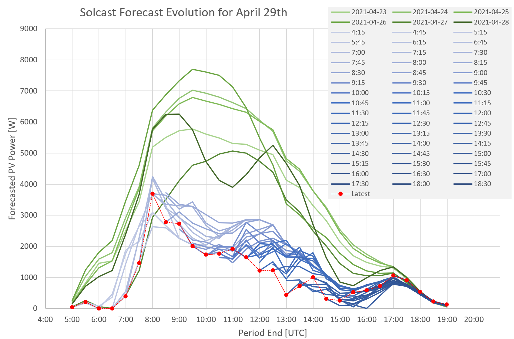

---
title: Introduction
layout: template
order: 1
filename: index
--- 

# PVForecast Introduction and Overview
Energy production forecast for a rooftop PV (photo-voltaic) system
 
## Introduction
This project supports an extensive set of production forecasts for PV rooftop installations. Various weather [data sources](README#forecast-sources), [PV modeling algorithms](README#forecast-models) and [storage methods](README#data-storage) for results can be used. Split array PV installations are supported.

The project has been developped on Python3, runs on Raspberries and integrates with [solaranzeige](https://solaranzeige.de), which allows easy monitoring of a PV system.

Two flavors exist, differing in the installation effort and the supported data sources. A light version focuses on [Solcast](https://solcast.com/) forecasts only, but is significantly easier to install and configure than the full version supporting more weather data sources.

See the [Users Guide](README) for a full description of installation and configuration procedures for both versions.

----------- 
## Table of Content
  * [Introduction](#introduction)
  * [Functional overview and rough comparision](#functional-overview-and-rough-comparision)
    + [Solcast](#solcast)
    + [Traditional weather services](#traditional-weather-services)
    + [Forcast horizon](#forcast-horizon)
    + [Quantifying forecast quality](#quantifying-forecast-quality)
  * [Disclaimer](#disclaimer)
  * [License](#license)

<small><i><a href='http://ecotrust-canada.github.io/markdown-toc/'>Table of contents generated with markdown-toc</a></i></small>

-----------

## Functional overview and rough comparision

### Solcast

[Solcast](https://solcast.com/) is specializing on worldwide PV performance forecasts, based on satellite imaging. They offer forecasts for rooftop installations free-of-charge for up to dual-array configurations.

The following shows forecast and actual data for a week in early May 2021:

For comparison reasons, also DWD (MOSMIX = `disc`) is shown. It seems obvious that SolCast does overall a much better job. It also provides a confidence interval (p10, p90) for its forecasts. We should hence expect that for any 30min interval, actual PV output is in 80% of cases between these bounds.

### Traditional weather services

PV performance forecasts can be done from traditional weather data (supported providers: [VisualCrossing](https://www.visualcrossing.com/) (as of PVForecast v2.00), [Deutscher Wetterdienst](https://www.dwd.de/DE/leistungen/met_verfahren_mosmix/) and [OpenWeatherMap.org](https://openweathermap.org/)) 

They may provide solar radiation data (GHI) or just cloud data. Both can be used to generate a PV power forecast. The following picture shows the result - for a particularly bad day, April 29, 2021:

For this to work, we first need have radiation data (GHI). In case we are based on cloud coverage, we estimate GHI from cloud coverage. Then, **GHI** (global horizontal irradiation, the solar power (in W) falling on a flat surface of 1m2) is decomposed into **DNI** (direct normal radiation - the part of energy falling on the same surface due to direct illumination by the sun) and **DHI** (diffuse horizontal irradiation - the part of energy falling on the same surface due to diffuse illumination, eg. due to reflection in clouds, etc.: the reason why it isn't pitch-blak in shadows ...).

Various models can be to estimate DNI from GHI and then DHI follows fundamental geometrical  equations `DNI = (GHI - DHI)/cos(Z)` where `Z` is the solar zenith angle (see eg. [Best Practices Handbook](https://www.nrel.gov/docs/fy15osti/63112.pdf))

The most common model to estimate GHI from cloud coverage is `clearsky_scaling` and the most common model to estimate DNI from GHI is `disc`. But the software described here supports a number of other [Irradiation models](./README#convert-weather-data-to-irradation-data). This is possible thanks to the extensive [pvlib](https://pvlib-python.readthedocs.io/en/stable/) library.

In the following picture, we use GHI (`Rad1h` in their lingo) from DWD/MOSMIX and calculate PV output power with `disc`. As GHI data is not available for all stations, `clearsky_scaling` uses cloud coverage data from DWD/MOSMIX. Both are reasonably closely related to each other:

As with any weather forecast, different providers sometimes diverge. OpenWeatherMap only provides cloud coverage, so - for fairness - we should only compare this with cloud-based forcasts from DWD:

Hmm... what to believe? Forecasts are difficult, especially those about the future! A chapter will be added here in the not too distant future, comparing one year of forecast data with actual production.

### Forcast horizon

For the example of Solcast, we'll investigate a bit how forecasts evolve over different forecast horizons. Solcast is updating its forcast every 15min (although forcast intervals are always fixed at 30min). The maximum forecast horizon is 7 days.

Hence, if we look at eg. April 29th, we get the following picture. The concept described here is identical for other forecast providers, although forecast updates are much rarer (hourly, six-hourly)

Forecasts from the preceding days (April 23rd .. April 28th) are updated about once a day (greenish) and as accurate as other weather forecasts. However, on the current day (April 29th), forecasts are updated every 15min (blueish).

The red line indicates the latest (last) forecast for the respective 30min time period. 

Hence, for this particular day, long term forecasts from previous days were far too optimistic. Satellite based current day forecasts were quite stable in the morning, but trended to lower PV output in the afternoon.

Comparing these forecasts with actuals, show that on this exceptional day, Solcast was still overly optimistic betweeen 8:00 and 12:00 and actuals were even outside the confidence interval of earlier forecasts.

Generally speaking, **SolCast** and **VisualCrossing** update their forecasts aggressively over time. **MOSMIX** does not significantly change forecasts once issued.

### Quantifying forecast quality

The above discussion motivates a deeper look at forecast quality as a function of forecast horizon: Which forecast is most accurate for current day / next day / future days?

Such data will eventually be published here, but it requires recording over an extended period in time.

The program discussed here supports different [storage models](../README#data-storage):
* SQLite storage model stores all data (ie., for every forecast `IssueTime`)
* Influx storage model stores only the respective latest forecast for each forecast `PeriodEnd`

Hence, Influx is useful to steer systems based on most recent forecast. SQLite allows to research forecast performance over forecast horizon.

## Disclaimer
The software pulls weather data from various weather sources. It is the users responsability to adhere to the use conditions of these sources. 

The author cannot provide any warranty concerning the availability, accessability or correctness of such weather data and/or the correct computation of derieved data for any specific use case or purpose.

Further warranty limitations are implied by the license

## License
Distributed under the terms of the GNU General Public License v3.
